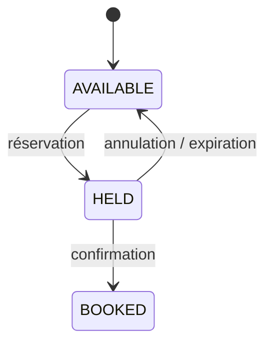

# RePlace

[English](README.md) · Français

**API de réservation de sièges conçue pour garantir qu'un même siège ne puisse jamais être réservé deux fois, même sous forte concurrence.**

Projet personnel en **Java / Spring Boot / PostgreSQL** centré sur la gestion de la concurrence, la cohérence transactionnelle et les conflits d'accès à une ressource unique.

---

## Le problème

Réserver un siège semble être une opération CRUD classique, jusqu'à ce que plusieurs utilisateurs tentent de réserver le même siège au même moment.

RePlace traite deux situations principales :

- **plusieurs clients réservent simultanément le même siège** ;
- **un client confirme une réservation pendant que le système tente de l'expirer**.

Dans les deux cas, l'objectif est le même : préserver la cohérence entre la réservation et l'état réel du siège.

---

## Gestion de la concurrence

### Réservation d'un même siège

La création d'une réservation utilise un **verrou pessimiste** :

```java
@Lock(LockModeType.PESSIMISTIC_WRITE)
@Query("SELECT s FROM Seat s WHERE s.id IN :ids ORDER BY s.id")
List<Seat> findAllByIdForUpdate(@Param("ids") List<UUID> ids);
```

PostgreSQL utilise ainsi un `SELECT ... FOR UPDATE`.

Une seule transaction peut modifier le siège à la fois. Une fois le siège passé en `HELD`, les transactions suivantes relisent son nouvel état et sont rejetées avec un `409 Conflict`.

L'ordre des lignes est également imposé avec `ORDER BY s.id` afin que les transactions acquièrent leurs verrous dans le même ordre et réduisent le risque d'interblocage.

### Confirmation vs expiration

La course entre la confirmation d'un client et l'expiration automatique utilise du **verrouillage optimiste** avec `@Version`.

Si deux transactions modifient la même réservation à partir de la même version, une seule peut être validée. La seconde provoque un conflit traduit en `409 Conflict`.

Le choix est volontaire :

- **pessimiste** lorsque la contention sur le siège est probable ;
- **optimiste** lorsque le conflit est occasionnel.

---

## Tests de concurrence

Le comportement est vérifié avec des tests d'intégration utilisant la pile HTTP réelle.

### 100 requêtes sur un seul siège

`ReservationConcurrencyTest` déclenche **100 requêtes simultanées** vers le même siège.

Résultat attendu :

```text
1   réservation réussie
99  réponses 409 Conflict
0   erreurs inattendues
```

Le test vérifie également l'état final de la base : un seul lien siège-réservation existe et le siège est `HELD`.

### Confirmation contre expiration

`ReservationConfirmExpireRaceTest` lance simultanément une confirmation et une expiration sur la même réservation.

Le scénario est répété **40 fois** et vérifie que les états restent cohérents :

```text
CONFIRMED  -> BOOKED
EXPIRED    -> AVAILABLE
```

### Suite complète

```text
Tests run: 48, Failures: 0, Errors: 0, Skipped: 0
```

---

## Cycle de vie



Les transitions sont portées par les entités elles-mêmes. Une transition invalide est refusée avant de pouvoir produire un état incohérent.

Les réservations non confirmées expirent **15 minutes** après leur création. Un job de fond balaie les réservations échues, donc une réservation reste confirmable durant le court intervalle entre son échéance et le passage suivant.

---

## Architecture

Architecture Spring volontairement simple :

```text
controller
    ↓
service
    ↓
repository
    ↓
PostgreSQL
```

Les entités conservent leurs propres règles de transition (`hold`, `book`, `release`, `confirm`).

L'objectif est de garder la logique métier proche des objets concernés sans introduire une architecture plus complexe que le domaine ne le nécessite.

---

## Démarrer

Prérequis : **Docker + Docker Compose**

```bash
cp .env.example .env
docker compose up --build
```

API :

```text
http://localhost:8080
```

Swagger :

```text
http://localhost:8080/swagger-ui.html
```

Flyway applique automatiquement les migrations au démarrage.

### Tests

```bash
./mvnw test
```

> Les tests d'intégration nettoient les tables utilisées. Utiliser une base PostgreSQL dédiée aux tests.

---

## API principale

| Méthode | Route                        | Accès        |
| ------- | ---------------------------- | ------------ |
| `POST`  | `/auth/register`             | public       |
| `POST`  | `/auth/login`                | public       |
| `GET`   | `/events`                    | public       |
| `POST`  | `/events`                    | admin        |
| `GET`   | `/events/{eventId}/seats`    | public       |
| `POST`  | `/reservations`              | authentifié  |
| `POST`  | `/reservations/{id}/confirm` | propriétaire |
| `POST`  | `/reservations/{id}/cancel`  | propriétaire |
| `GET`   | `/reservations`              | authentifié  |

Authentification stateless par **JWT HS256**.

---

## Stack

`Java 21` · `Spring Boot 4.1` · `Spring Data JPA` · `Spring Security` · `PostgreSQL 16` · `Flyway` · `JWT` · `JUnit 6` · `Docker Compose` · `OpenAPI`
