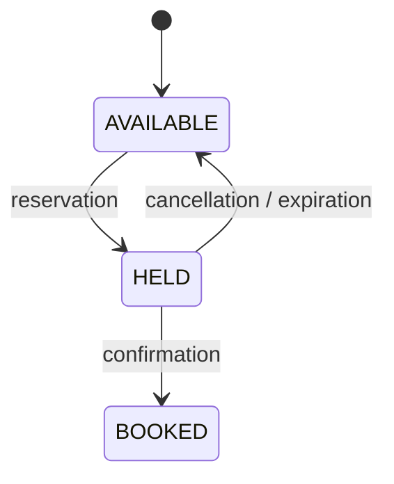

# RePlace

English · [Français](README.fr.md)

**Seat reservation API designed to ensure that the same seat can never be booked twice, even under high concurrency.**

Personal project built with **Java / Spring Boot / PostgreSQL**, focused on concurrency management, transactional consistency, and conflicts around access to a unique resource.

---

## The Problem

Booking a seat may look like a standard CRUD operation, until multiple users try to reserve the same seat at the same time.

RePlace handles two main situations:

- **multiple clients simultaneously booking the same seat**;
- **a client confirming a reservation while the system is trying to expire it**.

In both cases, the goal is the same: preserve consistency between the reservation and the actual state of the seat.

---

## Concurrency Management

### Booking the Same Seat

Creating a reservation uses a **pessimistic lock**:

```java
@Lock(LockModeType.PESSIMISTIC_WRITE)
@Query("SELECT s FROM Seat s WHERE s.id IN :ids ORDER BY s.id")
List<Seat> findAllByIdForUpdate(@Param("ids") List<UUID> ids);
```

PostgreSQL therefore uses `SELECT ... FOR UPDATE`.

Only one transaction can modify the seat at a time. Once the seat has been moved to `HELD`, subsequent transactions read its new state and are rejected with a `409 Conflict`.

The row order is also enforced with `ORDER BY s.id` so that transactions acquire their locks in the same order and reduce the risk of deadlocks.

### Confirmation vs Expiration

The race between a client's confirmation and automatic expiration uses **optimistic locking** with `@Version`.

If two transactions modify the same reservation from the same version, only one can be committed. The second results in a conflict translated into a `409 Conflict`.

The choice is intentional:

- **pessimistic** when contention over a seat is likely;
- **optimistic** when conflicts are occasional.

---

## Concurrency Tests

The behavior is verified with integration tests using the real HTTP stack.

### 100 Requests on a Single Seat

`ReservationConcurrencyTest` sends **100 simultaneous requests** for the same seat.

Expected result:

```text
1   successful reservation
99  409 Conflict responses
0   unexpected errors
```

The test also verifies the final database state: only one seat-reservation relationship exists and the seat is `HELD`.

### Confirmation vs Expiration

`ReservationConfirmExpireRaceTest` simultaneously triggers a confirmation and an expiration on the same reservation.

The scenario is repeated **40 times** and verifies that the resulting states remain consistent:

```text
CONFIRMED  -> BOOKED
EXPIRED    -> AVAILABLE
```

### Full Test Suite

```text
Tests run: 48, Failures: 0, Errors: 0, Skipped: 0
```

---

## Lifecycle



State transitions are handled directly by the entities. An invalid transition is rejected before it can produce an inconsistent state.

Unconfirmed reservations expire **15 minutes** after creation. A background job sweeps expired reservations, so a reservation stays confirmable during the short window between its deadline and the next sweep.

---

## Architecture

Intentionally simple Spring architecture:

```text
controller
    ↓
service
    ↓
repository
    ↓
PostgreSQL
```

Entities keep their own transition rules (`hold`, `book`, `release`, `confirm`).

The goal is to keep business logic close to the objects it belongs to without introducing an architecture more complex than the domain requires.

---

## Getting Started

Requirements: **Docker + Docker Compose**

```bash
cp .env.example .env
docker compose up --build
```

API:

```text
http://localhost:8080
```

Swagger:

```text
http://localhost:8080/swagger-ui.html
```

Flyway automatically applies database migrations at startup.

### Tests

```bash
./mvnw test
```

> Integration tests clear the tables they use. Use a dedicated PostgreSQL database for testing.

---

## Main API

| Method | Route                        | Access        |
| ------ | ---------------------------- | ------------- |
| `POST` | `/auth/register`             | public        |
| `POST` | `/auth/login`                | public        |
| `GET`  | `/events`                    | public        |
| `POST` | `/events`                    | admin         |
| `GET`  | `/events/{eventId}/seats`    | public        |
| `POST` | `/reservations`              | authenticated |
| `POST` | `/reservations/{id}/confirm` | owner         |
| `POST` | `/reservations/{id}/cancel`  | owner         |
| `GET`  | `/reservations`              | authenticated |

Stateless authentication using **JWT HS256**.

---

## Stack

`Java 21` · `Spring Boot 4.1` · `Spring Data JPA` · `Spring Security` · `PostgreSQL 16` · `Flyway` · `JWT` · `JUnit 6` · `Docker Compose` · `OpenAPI`
